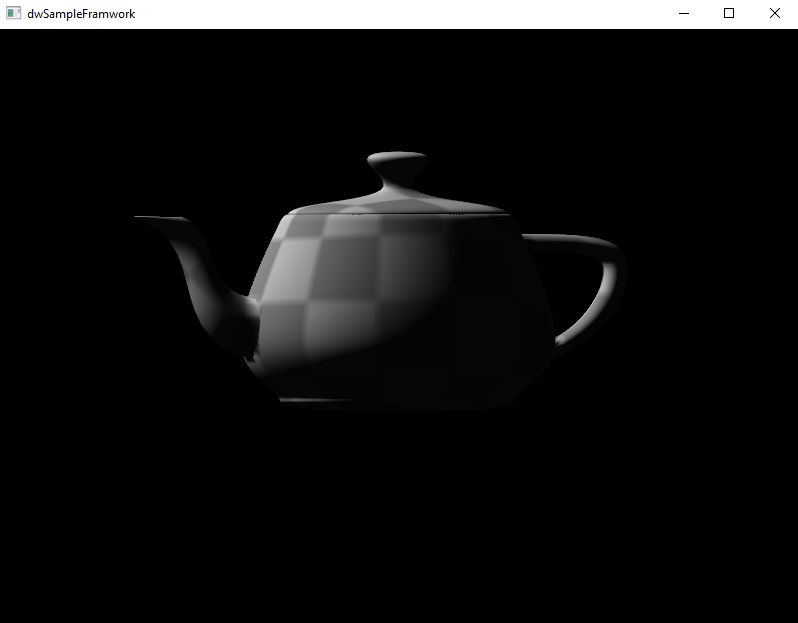

# dwSampleFramework

[](https://opensource.org/licenses/MIT)

## What is it?
A simple C++ framework for implementing graphics technique samples.

## Features
* Cross-platform
* Mesh loading
* Texture loading
* Input
* Configuration via JSON
* Debug drawing
* Graphics API abstraction via Terminus-GFX
* Camera class

## What it looks like
Creating a project using dwSampleFramework is as easy as inheriting from the dw::Application class and overriding the methods you need.

```c++
#include <application.h>

class Tutorial : public dw::Application
{
protected:
	bool init(int argc, const char* argv[]) override
	{
		return true;
	}

	void update(double delta) override
	{

	}

	void shutdown() override
	{

	}
};

DW_DECLARE_MAIN(Tutorial)
``` 

## Sample 
The sample application will give you a basic understanding of how to create a simple graphics application using the framework. It simply renders a rotating Teapot. 



## Building Sample
Use [CMake](https://cmake.org/) version 3.8 or higher to generate a project for any IDE of your choice. The resulting project will contain all dependencies, framework library and sample application.

## How to use in a project
This will only cover using dwSampleFramework in a project that uses CMake since it is more practical and will make handling dependencies easier.

1. Add dwSampleFramework as a submodule or simply clone it into your external dependencies directory. Make sure all submodules of the framework are also cloned.
2. Add the dwSampleFramework directory to the root CMakeLists.txt file via the following command.
```
add_subdirectory(path/to/dwSampleFramework)
```
3. Add a link command to your executable that will use the framework.
```
target_link_libraries(TARGET_NAME dwSampleFramework)
```
4. Add dwSampleFramework include directory to your projects' includes (either using `include_directories` or `target_include_directories`).

Note: If you wish to use dwSampleFramework as a precompiled library, make sure you copy the generated Assimp config.h file to your Assimp include directory.

## Dependencies
* [Terminus-GFX](https://github.com/diharaw/Terminus-GFX) 
* [GLFW](https://github.com/glfw/glfw) 
* [Assimp](https://github.com/assimp/assimp) 
* [json](https://github.com/nlohmann/json) 
* [glm](https://github.com/g-truc/glm) 
* [imgui](https://github.com/ocornut/imgui) 
* [stb](https://github.com/nothings/stb) 

## License
```
Copyright (c) 2018 Dihara Wijetunga

Permission is hereby granted, free of charge, to any person obtaining a copy of this software and 
associated documentation files (the "Software"), to deal in the Software without restriction, 
including without limitation the rights to use, copy, modify, merge, publish, distribute, sublicense,
and/or sell copies of the Software, and to permit persons to whom the Software is furnished to do so, 
subject to the following conditions:

The above copyright notice and this permission notice shall be included in all copies or substantial
portions of the Software.

THE SOFTWARE IS PROVIDED "AS IS", WITHOUT WARRANTY OF ANY KIND, EXPRESS OR IMPLIED, INCLUDING BUT NOT 
LIMITED TO THE WARRANTIES OF MERCHANTABILITY, FITNESS FOR A PARTICULAR PURPOSE AND NONINFRINGEMENT. 
IN NO EVENT SHALL THE AUTHORS OR COPYRIGHT HOLDERS BE LIABLE FOR ANY CLAIM, DAMAGES OR OTHER LIABILITY,
WHETHER IN AN ACTION OF CONTRACT, TORT OR OTHERWISE, ARISING FROM, OUT OF OR IN CONNECTION WITH THE 
SOFTWARE OR THE USE OR OTHER DEALINGS IN THE SOFTWARE.
```